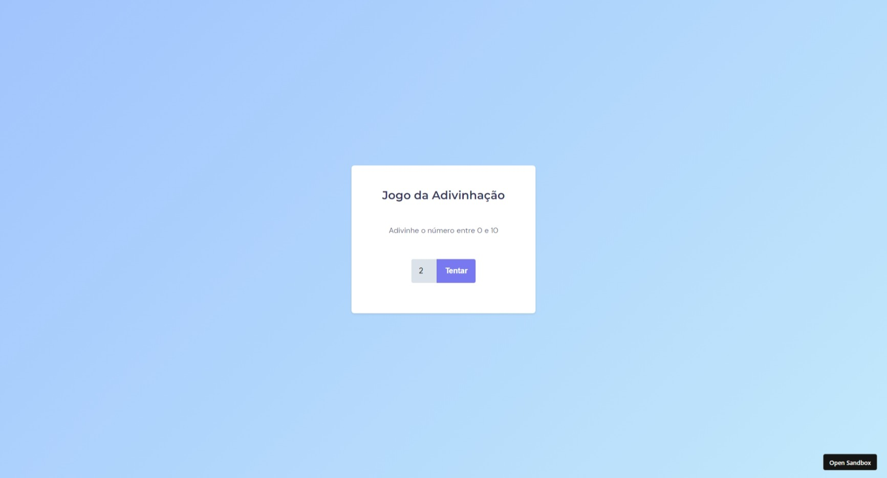

# Jogo Adivinha
A ideia agora é criar o Jogo da Adivinhação, onde o usuario vai digita um número na tentativa de adivinha qual o número que sera selecionado pela logica da maquina.

Aqui está o [**link**](https://www.figma.com/file/5pZNHokTKTvld18xVAbk5C/Jogo-Adivinha%C3%A7%C3%A3o/duplicate) com o layout da aplicação. Ele abrirá um arquivo igual a imagem abaixo:

## Deploy

Para fazer o deploy desse projeto rode  

## Demonstração

  

